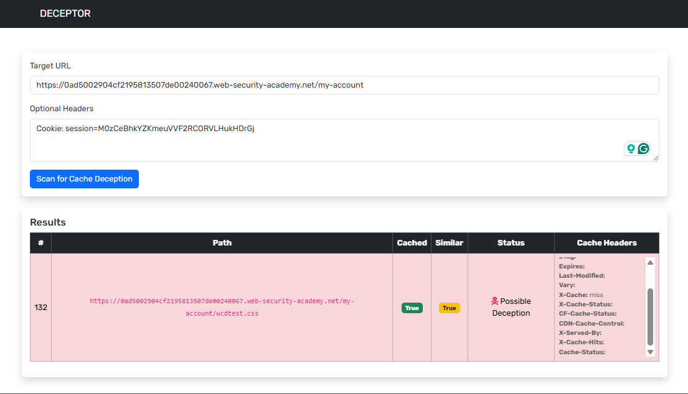

# DECEPTOR: An automated script to bypass web-Cache Deception

## NOTE: Still, this script has some issues, like inconsistent results. If you can fix it, feel free to create a PR



---

# 🕵️ Web Cache Deception (WCD) Rule Book

## ✅ Test for Web Cache Deception When:

| Rule # | Condition | Why You Should Test |
|--------|-----------|----------------------|
| 1 | The URL returns **user-specific data** (e.g., `/account`, `/dashboard`) | Risk of leaking private info |
| 2 | The endpoint allows **adding fake static extensions** (e.g., `/profile.css`, `/orders.jpg`) | Tricks cache into thinking it's a static file |
| 3 | Response contains **sensitive data** (email, tokens, names, balances) | If cached, it can be accessed by others |
| 4 | No or weak **Cache-Control headers** (e.g., no `private`, `no-store`) | Cache may store user content |
| 5 | Uses **CDNs or reverse proxies** (e.g., Cloudflare, Akamai, Varnish) | More likely to cache improperly |
| 6 | You get **same 200 response** even without auth | Means public users may trigger cache storage |
| 7 | Response has **headers like `X-Cache: HIT`, `Age`, or `Via`** | Indicates caching is in place |
| 8 | You're able to add **arbitrary parameters or paths** (e.g., `/user?id=1&fake=.jpg`) | Some caches ignore query strings or suffixes |
| 9 | The application uses **clean, extension-less URLs** (e.g., `/user/settings`) | Adding extensions to these might trick the cache |
| 10 | Endpoint behaves differently **per user session**, but uses same path | Suggests a cache risk if not marked `private` |
| 11 | There's no `Set-Cookie` but still shows user data | May indicate token-based or header-based auth, increasing WCD risk |
| 12 | Static file paths return 200 with **dynamic content** (e.g., `/profile.jpg` showing HTML) | Cache thinks it's safe static file, but it's not |
| 13 | Cache headers like `Cache-Control: public` or `max-age=X` are present on private endpoints | Dangerous misconfiguration |
| 14 | Testing reveals cache **shares response between users** | Critical — should test deeply for WCD |

---

## ❌ Don’t Test for Web Cache Deception When:

| Rule # | Condition | Why You Should Skip Testing |
|--------|-----------|-----------------------------|
| 1 | Response has **`Cache-Control: private`, `no-store`, or `no-cache`** | These prevent shared caching |
| 2 | Response header shows **`max-age=0`** or **`s-maxage=0`** | Means revalidation is required — not cacheable |
| 3 | The endpoint **requires login** and responds with `401/403` if unauthenticated | Can’t trick cache into fetching it |
| 4 | The endpoint uses **POST-only methods** | POSTs are generally not cached by CDNs or proxies |
| 5 | You can't add fake file extensions to the URL | No trick = no WCD setup |
| 6 | Each request returns **randomized tokens** (e.g., CSRF, JWT, UUIDs) | Makes response non-cacheable or unique per user |
| 7 | The content is hosted on **user-specific subdomains** (e.g., `user1.site.com`) | Caching is isolated per user |
| 8 | There’s a **lack of CDN or caching layer** (check via headers) | No caching = no cache deception |
| 9 | The server adds headers like `Vary: Cookie`, `Vary: Authorization` | Prevents shared caching for personalized content |
| 10 | Static assets are already cached and don’t include dynamic/private info | These are safe and expected to be cached |

---

## 🔍 Bonus WCD Testing Tricks

- **Modify URLs like:**
  - `/endpoint` → `/endpoint.css`, `/endpoint;test.css`, `/endpoint.jpg`
  - `/endpoint` → `/endpoint.html`, `/endpoint.fake.js`
  - `/endpoint?x=1` → `/endpoint?x=1.css`
  - `/endpoint` → `/endpoint%23%2f%2e%2e%2fstatic?wcdtest`
  - `/endpoint` → `/endpoint%00.js` → `/endpoint%00.css`  ..etc
  - `/endpoint` → `/endpoint%0a.js` → `/endpoint%0a.css`  ..etc
  - `/endpoint` → `/endpoint$%2F%2E%2E%2Fstatic?wcdtest`
  - `/endpoint` → `/static/..%2fendpoint?wcdtest`
  - `/endpoint` → `/endpoint/..\\static?wcdtest`
  - `/endpoint` → `/endpoint$%2F%2E%2E/static?wcdtest`
  - `/endpoint` → `/static#/../endpoint?wcdtest`
  - `/endpoint` → `/endpoint$%2F%2E%2E/robots.txt?wcdtest`
  - `/endpoint` → `/endpoint;%2F%2E%2E/robots.txt?wcdtest`
  - `/endpoint` → `/endpoint#%2F%2E%2E/robots.txt?wcdtest`
  - `/endpoint` → `/endpoint;%2F%2E%2E%2Frobots.txt?wcdtest`
  - `/endpoint` → `/endpoint/../%73tyles.css`
  - `/endpoint` → `/wcdtest%2F%2E%2E%2Fendpoint`

- **Use `curl` or Burp to inspect headers:**
  ```bash
  curl -I https://target.com/account.css
